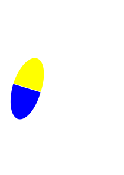
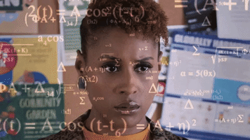
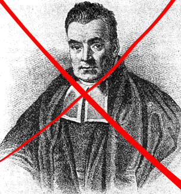
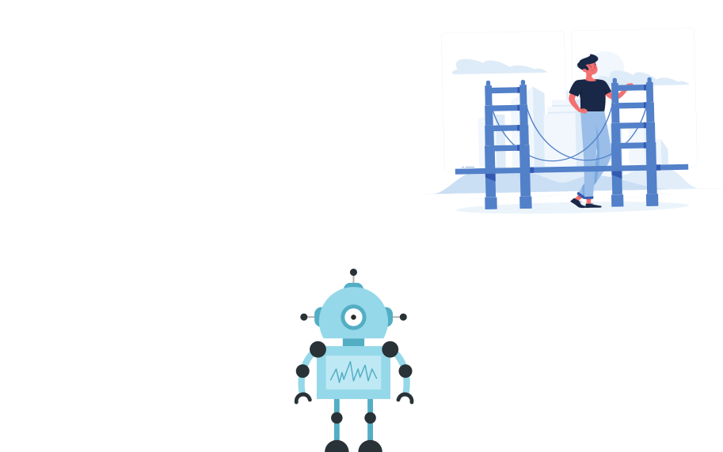
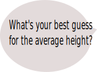
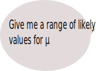
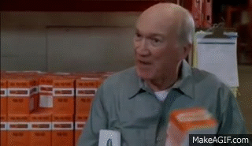
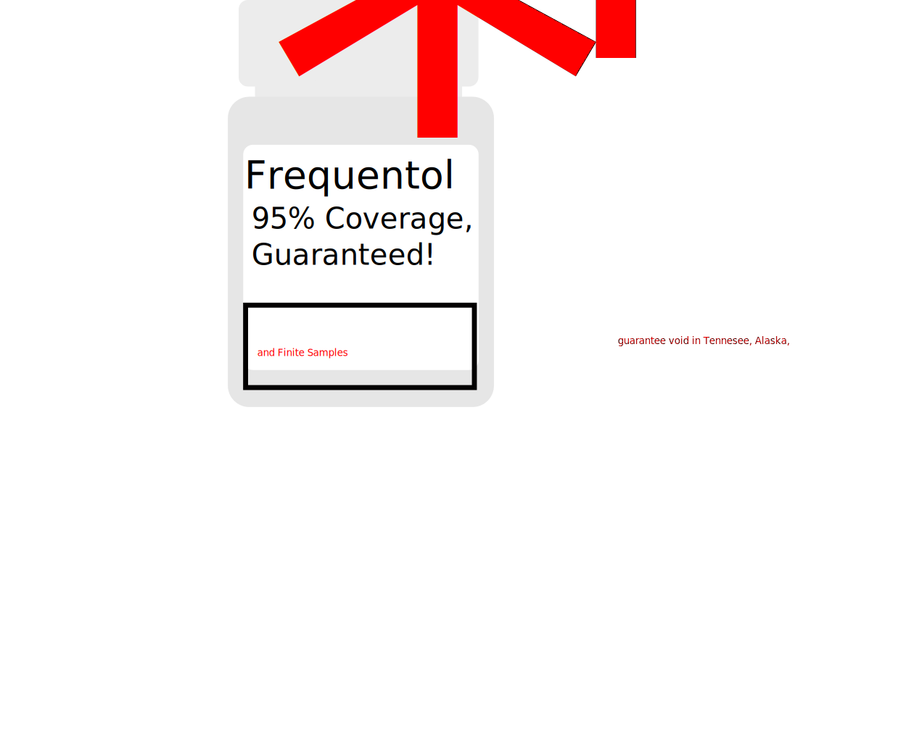

class: inverse
background-image: url(figures/orion.jpg)

--

.pull-left-title[
### Bayesian 

### Adaptive 

### Trials 
]

--

.pull-right-title[
### Or,

### How I Learned to Stop Worrying and Love Sample Size Calculations

]

--

.bottom-text[Scott Coggeshall 

HSR&D

VA Puget Sound

]


---
class:inverse

# Typical Fixed $n$ Randomized Trial

--




 


---


class:inverse

# Typical Fixed $n$ Randomized Trial


--

- RCT time! But how many people?

--

- Sample size calculation says we need $n$ = 20!

--


---
class:inverse

# Typical Fixed $n$ Randomized Trial


- RCT time! But how many people?


- Sample size calculation says we need $n$ = 20!


---
class:inverse

# Typical Fixed $n$ Randomized Trial


- RCT time! But how many people?


- Sample size calculation says we need $n$ = 20!


 
 

---

class:inverse

# Typical Fixed $n$ Randomized Trial


- RCT time! But how many people?


- Sample size calculation says we need $n$ = 20!


---
class:inverse

--

What if we want to do something...

--

 .large[*crazy*]...

--

like take some interim looks at the data?

--

Corrections, corrections, corrections!

--
.left[

]

--

.right[

]


--

.center[

]


--

.bottomleft[


]

--

.bottomright[

]
---
class: inverse

--

## I know what you're thinking...

--


---
class:inverse

--


--

The Right Reverend Thomas Bayes (1702-1761)

--

.right[

]

---
class:inverse





The Right Reverend Thomas Bayes (1702-1761)


.right[

]
---
class:inverse

--


--

Pierre-Simon Laplace (1749-1827)

--

> Probability is common sense reduced to a calculus. It makes one estimate accurately what right-minded people feel by a sort of instinct, often without being able to give a reason for it

--


---
class:inverse


Pierre-Simon Laplace (1749-1827)


> Probability is common sense reduced to a calculus. It makes one estimate accurately what right-minded people feel by a sort of instinct, often without being able to give a reason for it


---
class:inverse

.pull-left[

## Bayes Bot

<br>
<br>


]

.pull-right[

## Freq Bot

<br>
<br>


]

--

How do they see statistical models?


---
class: inverse

Classic one-sample problem: estimate mean and variance of a population

--

Let's be really boring and say we want to estimate the average height of a group of people

--

We program both robots to "know" that Height has some distribution with a finite mean $E[Height] = \mu$ and finite variance $Var[Height] = \sigma^2$


---
class: inverse
--
Let's start with Freq Bot

--

.pull-right[]

--

Freq Bot "knows" that

--

- Height has some finite mean $\mu$

--

- Height has some finite variance $\sigma^2$

--

- ...and that's it!

--

So what's it thinking before it sees any data?

---
class: inverse, center


---
class: inverse, center




---
class: inverse, center


---
class: inverse, center


---
class: inverse
Now let's see what's going on with Bayes Bot

--

.pull-right[]

--

Bayes Bot "knows" everything that Freq Bot knows

--

- Height has some finite mean $\mu$

--

- Height has some finite variance $\sigma^2$

--

...plus some extra stuff about $\mu$ and $\sigma^2$ that Freq Bot doesn't.

--

How do we "program" that extra knowledge about $\mu$ and $\sigma^2$ into Bayes Bot? 

--

We want Bayes Bot to have an opinion about what it might see...
--
but also be able to change that opinion!

--

We encode that extra knowledge in the form of a probability distribution called the prior distribution

--

.pull-left[

```{r dev.args = list(bg = "transparent"), echo = FALSE, fig.height = 4}

curve(dnorm(x, mean = 6, sd = 2), from = 1, to = 11, lwd = 4, col = "blue", xlab = expression(mu), ylab = "", cex.lab = 3, yaxt = "n", bty = "n", mar = rep(0, 4) + .1, cex.axis = 2)

```

]

.pull-right-fig[
```{r dev.args = list(bg = "transparent"), echo = FALSE, fig.height = 4}
curve(dcauchy(x, location = 0, scale = 1), from = 0, to = 10, lwd = 4, col = "blue", xlab = expression(sigma^2), cex.lab = 3, yaxt = "n", bty = "n", ylab = "", mar = rep(0, 4) + .1, cex.axis = 2 )
```
]


---
class: inverse, center


---
class: inverse, center


---
class: inverse, center


---
class: inverse, center


---
class: inverse
Before seeing any data,

--

- Freq Bot is ready for anything (really, anything)

--

- Bayes Bot has some opinions, but is keeping an open mind

--

We're almost ready to give both of these bots some data
--

But first, they both need to be equipped with additional tools in order to do *statistical inference*

--

Freq Bot will almost always get something based on asymptotics like a Central Limit Theorem,

--


--

while Bayes Bot will get a likelihood (or data model),

--


---
The data look like

```{r}

loadd(heights)

```
`r heights`

---
class: inverse

--
.pull-left[


<br>
<br>
<br>
<br>


]
--

.pull-right[


]

---
class:inverse


---
class: inverse


--

.right[

]

---
class:inverse


.right[

]

---
class:inverse


.right[

]

---

class:inverse


.right[

]

---
class:inverse


.right[

]

---
class:inverse


.right[

]

---
class: inverse, center

--




### *There's no guarantee on the box!*

---
class: inverse, center

--

---
class: inverse, center



---
class: inverse, center


---
class: inverse

--

NOSE nasal swab study

